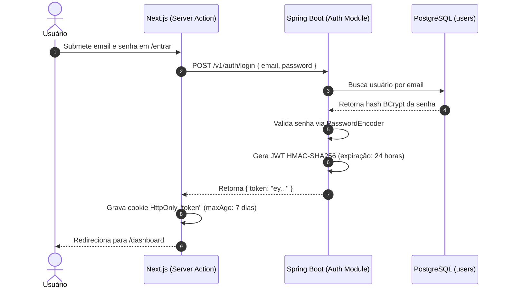
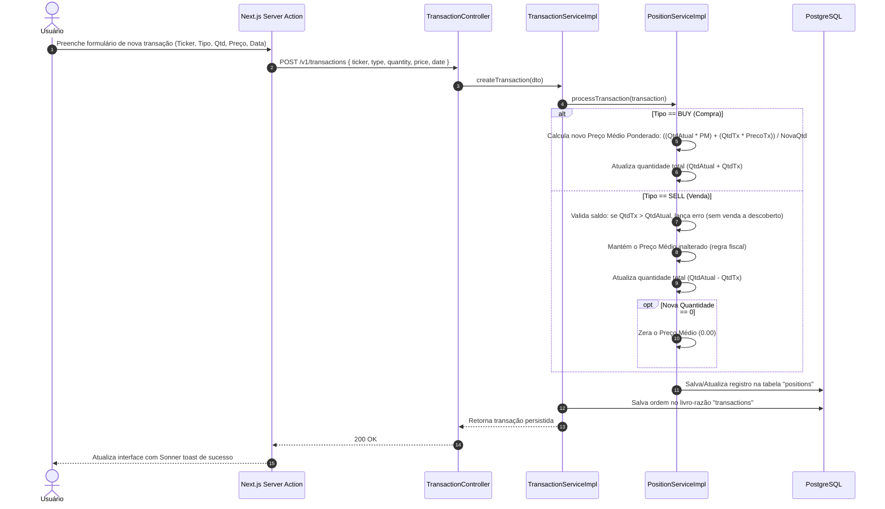
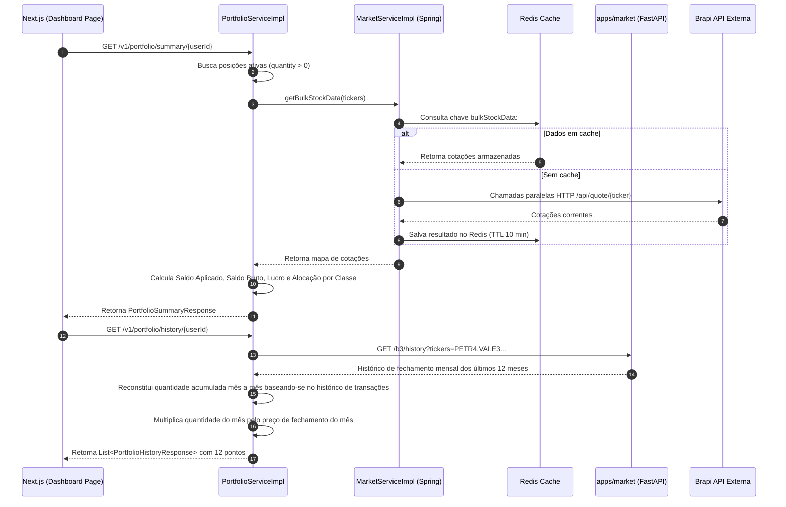

# Arquitetura do Sistema — Zuno (Consolidador de Investimentos)

Este documento descreve a arquitetura técnica, os fluxos de dados, a modelagem de persistência, as regras de negócio e a infraestrutura do **Zuno**. O objetivo é servir como referência técnica para qualquer desenvolvedor ou agente que precise manter, estender ou debugar o sistema.

---

## 1. Estrutura do Projeto

O projeto adota a estrutura de monorepo poliglota gerenciado via workspace do `pnpm`, orquestrado localmente por `docker-compose` e automatizado com tarefas do `Taskfile`. A separação divide o núcleo transacional (Java/Spring Boot), o microserviço de dados de mercado (Python/FastAPI) e a interface do usuário (TypeScript/Next.js).

```
consolidador-investimentos/
├── apps/
│   ├── api/                                  # Backend transacional (Java 21 / Spring Boot 3.5.5)
│   │   ├── Dockerfile                        # Multi-stage build com Layertools do Spring Boot
│   │   ├── fly.toml                          # Manifesto de deploy na Fly.io (512MB RAM em gru)
│   │   ├── pom.xml                           # Dependências Maven (Security, JPA, Redis, Jasper, Flyway)
│   │   └── src/
│   │       ├── main/java/com/ilanzgx/demo/
│   │       │   ├── DemoApplication.java      # Bootstrap da aplicação Spring Boot
│   │       │   ├── config/                   # Configurações de infraestrutura e segurança
│   │       │   │   ├── JwtAuthFilter.java    # Filtro OncePerRequest para validação do Bearer Token
│   │       │   │   ├── PasswordConfig.java   # Bean do BCryptPasswordEncoder
│   │       │   │   └── SecurityConfig.java   # Regras de rotas públicas/privadas, CORS e sessão stateless
│   │       │   └── modules/                  # Módulos organizados por domínio (DDD)
│   │       │       ├── auth/                 # Registro, login e emissão de tokens JWT
│   │       │       ├── dividend/             # Consulta e consolidação de proventos da B3
│   │       │       ├── market/               # Facade com cache Redis para Brapi e microserviço Python
│   │       │       ├── portfolio/            # Consolidação patrimonial e cálculo histórico de 12 meses
│   │       │       ├── position/             # Gestão de custódia e cálculo do Preço Médio Ponderado
│   │       │       ├── report/               # Compilação e emissão de relatórios PDF com JasperReports
│   │       │       ├── shared/               # Enums compartilhados (AssetType) e cliente HTTP genérico
│   │       │       ├── transaction/          # Livro-razão imutável de ordens de compra e venda
│   │       │       └── user/                 # Entidade User, detalhes do usuário e perfis
│   │       └── main/resources/
│   │           ├── application.yml           # Configurações de banco, Redis, endpoints e health check
│   │           ├── db/migration/             # Scripts Flyway versionados (V1__create_initial_schema.sql)
│   │           └── reports/                  # Template JasperReports XML (portfolio.jrxml)
│   │
│   ├── market/                               # Microserviço de cotações e scraping (Python 3.13 / FastAPI)
│   │   ├── Dockerfile                        # Imagem slim com instalador uv e usuário sem privilégios
│   │   ├── fly.toml                          # Configuração para deploy na Fly.io (256MB RAM em gru)
│   │   ├── pyproject.toml                    # Dependências gerenciadas via uv (fastapi, yfinance, pandas)
│   │   ├── uv.lock                           # Lockfile determinístico de dependências Python
│   │   ├── src/
│   │   │   ├── main.py                       # Ponto de entrada FastAPI e registro de rotas
│   │   │   ├── api/v1/                       # Controladores REST por tipo de dado
│   │   │   │   ├── b3_quote.py               # Cotações pontuais e históricas da B3
│   │   │   │   ├── b3_history.py             # Histórico de preços em lote e fechamentos mensais
│   │   │   │   ├── b3_dividends.py           # Proventos passados filtrados por data
│   │   │   │   ├── b3_news.py                # Notícias financeiras relacionadas aos tickers
│   │   │   │   └── crypto_quote.py           # Cotação de pares de criptomoedas com conversão cambial
│   │   │   └── services/
│   │   │       └── market_service.py         # Motor de integração com yfinance e manipulação via Pandas
│   │   └── tests/                            # Testes unitários com pytest e mocks do yfinance
│   │
│   └── web/                                  # Interface do usuário (Next.js 16.3.6 / React 19.1)
│       ├── Dockerfile                        # Node 24 Alpine standalone para produção
│       ├── next.config.ts                    # Configurações do Next.js, rewrites e modo standalone
│       ├── package.json                      # Scripts e dependências do frontend (Radix UI, Recharts, Tailwind 4)
│       └── src/
│           ├── middleware.ts                 # Interceptor de borda para validação de sessão e redirecionamentos
│           ├── app/
│           │   ├── (public)/                 # Rotas abertas: /entrar, /registrar
│           │   └── (protected)/              # Rotas autenticadas: /dashboard, /posicoes, /transacoes, etc.
│           ├── components/                   # Componentes React visuais, diálogos e barras laterais
│           ├── resources/                    # Server Actions ("use server") que operam como BFF
│           │   ├── auth/, user/, position/, transaction/, portfolio/, dividend/, market/, report/
│           │   └── */*.service.ts            # Comunicação servidor-a-servidor com a API Spring Boot
│           └── stores/                       # Estado cliente volátil via Zustand (user.store.ts)
│
├── .docker/                                  # Volumes persistentes locais para PostgreSQL e Redis
├── .github/workflows/ci.yml                  # Pipeline de integração contínua no GitHub Actions
├── docker-compose.yml                        # Orquestração local de banco de dados, cache e serviços
├── Taskfile.yml                              # Automação de tarefas para rodar dev, testes e builds
├── LOCAL_DEVELOPMENT.md                      # Instruções práticas para rodar a aplicação localmente
└── package.json                              # Raiz do workspace pnpm para scripts simultâneos
```

---

## 2. Diagramas do Sistema e Fluxos de Dados

### 2.1. Visão Geral de Comunicação Entre Componentes

O Zuno separa claramente responsabilidades: o navegador interage apenas com a camada web (Next.js), as Server Actions fazem a ponte segura com o núcleo de regras de negócio em Spring Boot, e a API orquestra o banco relacional, o cache em memória e os serviços de dados de mercado.

```
+-----------------------------------------------------------------------------------+
|                                 Navegador do Usuário                              |
|                       (Páginas React 19, Recharts, Tailwind CSS)                  |
+-----------------------------------------------------------------------------------+
                                         |
                                         | Requisições HTTP e Server Actions
                                         | Cookie HttpOnly ("token")
                                         v
+-----------------------------------------------------------------------------------+
|                            apps/web (Next.js 16 App Router)                       |
|           Middleware Edge (validação de sessão) + Server Actions (BFF)             |
+-----------------------------------------------------------------------------------+
                                         |
                                         | HTTP REST com cabeçalho
                                         | Authorization: Bearer <JWT>
                                         v
+-----------------------------------------------------------------------------------+
|                        apps/api (Spring Boot 3.5.5 / Java 21)                     |
|           Filtro JWT, Regras Contábeis, JPA, Flyway, Emissão de PDF               |
+-----------------------------------------------------------------------------------+
           |                                   |                              |
           | JDBC                              | Cache L2                     | HTTP interno
           v                                   v                              v
+--------------------+               +-------------------+          +--------------------+
|   PostgreSQL 17    |               |      Redis 7      |          |    apps/market     |
| (users, positions, |               | TTL: 10 minutos   |          | (FastAPI / Python) |
|   transactions)    |               | Chaves de cotação |          +--------------------+
+--------------------+               +-------------------+                    |
                                                                              | Web Scraping
                                                                              v
                                     +-------------------+          +--------------------+
                                     |   Brapi Externa   |          |   Yahoo Finance    |
                                     | (Cotação ao vivo) |          | (Histórico/Provent)|
                                     +-------------------+          +--------------------+
```

---

### 2.2. Fluxo de Autenticação e Gestão de Sessão

O sistema adota autenticação baseada em JWT assinado com HMAC-SHA256, armazenado no navegador exclusivamente via cookie `HttpOnly`. O JavaScript em execução no cliente não tem acesso direto à string do token, o que reduz riscos de vazamento por ataques de script em linha (XSS).



Nas requisições subsequentes para páginas protegidas:
1. O arquivo `middleware.ts` do Next.js intercepta a rota.
2. Lê o cookie `token`. Caso não exista, redireciona de imediato para `/entrar`.
3. Executa `validateToken()`, que chama `GET /v1/users/me` na API enviando o token no cabeçalho `Authorization: Bearer <token>`.
4. O `JwtAuthFilter` do Spring Boot extrai o email do token, carrega os dados do usuário e autoriza a requisição. Se o token estiver expirado ou inválido, o Next.js remove o cookie e manda o usuário de volta para o login.

---

### 2.3. Fluxo de Registro de Transações e Recálculo de Custódia

Toda movimentação financeira registrada passa pela criação de uma transação imutável e pelo recálculo imediato da custódia do ativo correspondente na mesma operação.



---

### 2.4. Fluxo de Consolidação Patrimonial e Histórico de 12 Meses

O resumo da carteira exibido no painel principal exige a combinação das quantidades em custódia com as cotações correntes de mercado, enquanto o gráfico de patrimônio reconstrói a posição mês a mês.



---

## 3. Componentes Centrais

### 3.1. Frontend (`apps/web`)

Construído com Next.js 16 (App Router) e React 19. A aplicação utiliza o padrão de Server Actions para realizar todo o tráfego com o backend fora do alcance do cliente web.

- **Tecnologias:** React 19.1, TypeScript 5, Tailwind CSS 4, Radix UI (primitivas de acessibilidade), Lucide React (ícones), Recharts 3.5 (gráficos de área e pizza), Sonner (notificações) e Zustand 5 (armazena o perfil do usuário logado na memória do cliente).
- **Tratamento de rotas e segurança:** 
  - As páginas públicas ficam agrupadas sob `(public)` (`/entrar`, `/registrar`).
  - As páginas do sistema ficam agrupadas sob `(protected)` (`/dashboard`, `/posicoes`, `/transacoes`, `/patrimonio`, `/eventos`, `/noticias`, `/conta`).
  - O arquivo `src/middleware.ts` executa antes de cada requisição. Se a rota for protegida e o usuário não possuir cookie válido, o acesso é barrado antes mesmo de montar a árvore de componentes.
- **Isolamento de Segredos:** A comunicação com a API Spring Boot acontece de servidor para servidor via `fetch` nativo com `cache: "no-store"` dentro das Server Actions (`src/resources/**/*.service.ts`). O browser nunca recebe tokens em código client-side.
- **Inicialização de Estado:** O layout protegido (`src/app/(protected)/layout.tsx`) busca o perfil do usuário no servidor e alimenta a store cliente do Zustand por meio do componente utilitário `StoreInitializer`.

---

### 3.2. API Transacional (`apps/api`)

Desenvolvida em Java 21 sobre o framework Spring Boot 3.5.5. Centraliza as regras de negócio, a persistência relacional e a validação contábil das custódias.

- **Segurança Stateless:** O arquivo `SecurityConfig.java` desabilita proteção CSRF (adequado para APIs REST que não utilizam sessão de cookie no backend) e define política de sessão `SessionCreationPolicy.STATELESS`. Apenas as rotas `/v1/auth/**` e `/actuator/health` são públicas. Qualquer outro caminho exige o cabeçalho `Authorization: Bearer <token>`.
- **Validação de Tokens:** O `JwtAuthFilter` estende `OncePerRequestFilter`. A cada requisição, ele extrai o token, recupera o email do usuário por meio do `JwtServiceImpl` e injeta a instância de `UserDetails` no `SecurityContextHolder`.
- **Estrutura Modular por Domínio (DDD):**
  - `auth`: Controla login e registro. As senhas são codificadas usando o algoritmo BCrypt com custo padrão.
  - `user`: Persiste entidades `User` com UUID gerado aleatoriamente e timestamp de criação auditado pelo Hibernate (`@CreationTimestamp`).
  - `transaction`: Registra cada ordem de compra ou venda como evento imutável. Salva dados com precisão numérica decimal (`NUMERIC(38,2)` para preços monetários).
  - `position`: Mantém a posição consolidada por usuário e ticker (`UNIQUE(user_id, ticker)`). Executa a lógica de recálculo de preço médio ponderado a cada compra e validação de estoque a cada venda.
  - `portfolio`: Coordena a geração do resumo patrimonial e da evolução em 12 meses. Realiza chamadas otimizadas em lote para os ativos em custódia ativa.
  - `dividend`: Cruza as posições em carteira com o microserviço de mercado, identificando a data da primeira compra registrada do ativo para buscar proventos a partir desse marco temporal.
  - `market`: Atua como adaptador de dados de mercado. Aplica cache Redis via anotações `@Cacheable` em métodos de cotação simples, cotações em lote e dividendos.
  - `report`: Utiliza o motor do JasperReports para compilar o arquivo XML `reports/portfolio.jrxml` em tempo de execução, injetando os parâmetros de patrimônio do usuário e retornando o PDF gerado diretamente no corpo da resposta (`application/pdf`).
  - `shared`: Fornece enumerações comuns como `AssetType` (`STOCK`, `FII`, `BDR`) e a interface `HttpFetch` para desacoplar requisições HTTP da implementação concreta do `RestTemplate`.

---

### 3.3. Microserviço de Mercado (`apps/market`)

Serviço auxiliar construído em Python 3.13 com FastAPI 0.122, empacotado e administrado com o gerenciador de pacotes `uv`. Seu papel é isolar o scraping de dados não-oficiais e cálculos baseados em séries temporais fora da JVM.

- **Mapeamento de Tickers:** A classe `MarketService` adiciona automaticamente o sufixo `.SA` para ativos negociados na bolsa brasileira (exemplo: `PETR4` torna-se `PETR4.SA`), permitindo consulta direta no Yahoo Finance via biblioteca `yfinance`.
- **Rotas e Capacidades:**
  - `GET /b3/quote/{ticker}`: Retorna dados cadastrais e cotação regular (`regularMarketPrice`, dividend yield, P/L, valor patrimonial). Quando recebe o parâmetro opcional `date` (`dd/mm/yyyy`), busca uma janela de 5 dias em torno da data informada para encontrar o último preço de fechamento válido.
  - `GET /b3/history`: Recebe múltiplos tickers separados por vírgula e retorna séries históricas com agrupamento mensal (`interval="1mo"` e `period="1y"`), formatando datas como `YYYY-MM`.
  - `GET /b3/dividends/{ticker}`: Acessa a série de proventos distribuídos pela empresa e filtra registros cuja data de pagamento seja maior ou igual ao parâmetro `from_date`.
  - `GET /b3/news`: Busca feeds de notícias associados aos tickers solicitados e ordena os artigos cronologicamente pelo timestamp de publicação.
  - `GET /crypto/quote/{ticker}`: Consulta dados de pares de criptoativos e calcula a cotação convertida para Reais (BRL) consultando o par cambial `BRL=X`.

---

## 4. Armazenamento de Dados

O ecossistema utiliza dois mecanismos de persistência: um banco relacional para garantir integridade e transações financeiras ACID, e um cache em memória para evitar estrangulamento de requisições externas de cotação.

```
+------------------------------------------------------------------------------------+
|                                    PostgreSQL 17                                   |
+------------------------------------------------------------------------------------+
|  Tabela: users                                                                     |
|  - id (VARCHAR(255) PK)                                                            |
|  - email (VARCHAR(255) UNIQUE NOT NULL)                                            |
|  - name, password, created_at                                                      |
+------------------------------------------------------------------------------------+
       | 1
       | 
       | N (ON DELETE CASCADE)
       v
+------------------------------------------------------------------------------------+
|  Tabela: positions                                                                 |
|  - id (VARCHAR(255) PK)                                                            |
|  - ticker (VARCHAR(255))                                                           |
|  - quantity (INTEGER)                                                              |
|  - asset_type (VARCHAR(255) NOT NULL: STOCK, FII, BDR)                             |
|  - average_price (NUMERIC(19,2))                                                   |
|  - user_id (VARCHAR(255) FK users.id)                                              |
|  * Constraint de Unicidade: UNIQUE(user_id, ticker)                                |
|  * Índice: idx_positions_user_id                                                   |
+------------------------------------------------------------------------------------+
       ^
       | Registra ordens que alteram a custódia
+------------------------------------------------------------------------------------+
|  Tabela: transactions                                                              |
|  - id (VARCHAR(255) PK)                                                            |
|  - ticker (VARCHAR(255) NOT NULL)                                                  |
|  - type (VARCHAR(255) NOT NULL: BUY, SELL)                                         |
|  - quantity (INTEGER NOT NULL)                                                     |
|  - asset_type (VARCHAR(255) NOT NULL)                                              |
|  - price (NUMERIC(38,2) NOT NULL)                                                  |
|  - date (DATE NOT NULL)                                                            |
|  - user_id (VARCHAR(255) FK users.id ON DELETE CASCADE)                            |
|  - created_at (TIMESTAMP NOT NULL)                                                 |
|  * Índices: idx_transactions_user_date, idx_transactions_user_ticker               |
+------------------------------------------------------------------------------------+
```

### 4.1. PostgreSQL 17 (Banco Relacional Primário)
- **Evolução do Schema:** Controlada via migrações do Flyway (`classpath:db/migration`). O script `V1__create_initial_schema.sql` provisiona o estado inicial das tabelas.
- **Configuração do Hibernate:** Definida como `ddl-auto: validate` no arquivo `application.yml`. Isso impede que o JPA faça alterações não versionadas em tempo de inicialização, garantindo que o banco de dados seja manipulado exclusivamente por scripts SQL rastreáveis.
- **Índices de Apoio:**
  - `idx_positions_user_id`: Otimiza a listagem de custódias por usuário na tela de posições e no cálculo do portfólio.
  - `idx_transactions_user_date`: Acelera a consulta de transações recentes ordenadas por data decrescente.
  - `idx_transactions_user_ticker`: Permite recuperar rapidamente o histórico de compras de um ativo específico para localizar a primeira ordem de compra (usada no cálculo de dividendos).

### 4.2. Redis 7 (Camada de Cache L2)
- **Tempo de Vida (TTL):** Configurado globalmente no Spring Boot para 600.000 milissegundos (10 minutos), com descarte de valores nulos (`cache-null-values: false`).
- **Estratégias de Chave por Função:**
  - `simpleStockData` / `fullStockData`: Chave `#ticker` (ex: `PETR4`).
  - `bulkStockData`: Chave baseada no hash do conjunto de tickers (`#tickers.hashCode()`), evitando chamadas repetidas quando a mesma carteira de ações é requisitada em curto intervalo.
  - `stockDividendsData`: Chave composta `#ticker + '_' + #fromDate` (ex: `BBAS3_10/01/2024`).
  - `priceOnDate`: Chave composta `#ticker + #date`.
  - `userStockNews`: Chave atrelada ao identificador do usuário (`#userId`), cacheando o apanhado de notícias dos papéis que o investidor possui em carteira.

---

## 5. Integrações Externas e APIs

1. **Brapi (brapi.dev):**
   - Fornece cotações em tempo real de ativos negociados na bolsa brasileira.
   - Endpoint consumido: `/api/quote/{ticker}` com parâmetro opcional de módulos adicionais para indicadores fundamentalistas (`modules=summaryProfile&fundamental=true`).
   - Autenticação por token Bearer configurado na variável de ambiente `BRAPI_TOKEN`.
2. **Yahoo Finance (via `yfinance` no microserviço Python):**
   - Utilizado para extrair séries históricas consolidadas de fechamento diário e mensal.
   - Fornece a tabela de proventos com datas de corte e valores distribuídos.
   - Raspa títulos e links de notícias vinculados aos ativos da carteira.

---

## 6. Regras de Negócio e Cálculos Financeiros

### 6.1. Preço Médio Ponderado em Compras (BUY)
A cada compra registrada, o novo preço médio é recalculado pela média ponderada entre o patrimônio já investido no papel e o novo aporte:

$$PM_{\text{novo}} = \frac{(Qtd_{\text{atual}} \times PM_{\text{atual}}) + (Qtd_{\text{compra}} \times Preço_{\text{compra}})}{Qtd_{\text{atual}} + Qtd_{\text{compra}}}$$

O cálculo é realizado no método `PositionServiceImpl.handleBuy` utilizando `BigDecimal` com arredondamento `RoundingMode.HALF_UP` e precisão de 4 casas decimais durante o cálculo intermediário.

### 6.2. Regra de Venda (SELL) e Realização de Resultado
De acordo com a regulamentação fiscal brasileira para investimentos de renda variável:
- Vender um ativo **não altera o preço médio de aquisição** das cotas remanescentes.
- A quantidade em custódia é reduzida: $Qtd_{\text{nova}} = Qtd_{\text{atual}} - Qtd_{\text{venda}}$.
- O lucro ou prejuízo é realizado no momento da venda:
  
  $$PnL = (Preço_{\text{venda}} - PM) \times Qtd_{\text{venda}}$$

- Se a quantidade total resultante for zero ($Qtd_{\text{nova}} = 0$), a posição é considerada encerrada e o preço médio é resetado para `0.00`.
- Se a quantidade vendida for superior à mantida em custódia ($Qtd_{\text{venda}} > Qtd_{\text{atual}}$), o sistema rejeita a operação e lança exceção com a mensagem `"Venda a descoberto não permitida (Saldo insuficiente)"`.

### 6.3. Reconstrução Patrimonial em 12 Meses
Para traçar o gráfico de evolução do investidor, o método `PortfolioServiceImpl.getHistory` opera em memória da seguinte forma:
1. Carrega todas as transações do usuário no banco de dados.
2. Gera as chaves dos últimos 12 meses no formato `YYYY-MM`.
3. Calcula o saldo líquido de movimentação (compras menos vendas) de cada mês por ativo e acumula os valores progressivamente para saber a quantidade exata de ações que o usuário possuía no encerramento de cada mês.
4. Consulta o endpoint `/b3/history` do microserviço Python para obter a matriz de preços de fechamento daqueles mesmos meses.
5. Indexa os preços em um mapa bidimensional $Map<Ticker, Map<Mês, Preço>>$ permitindo consulta em tempo constante $O(1)$.
6. Multiplica a quantidade acumulada do mês pelo preço de fechamento do período, somando os valores de todos os papéis para compor o patrimônio daquele mês.

---

## 7. Deploy e Infraestrutura

### 7.1. Orquestração Local com Docker Compose
O arquivo `docker-compose.yml` na raiz sobe os serviços de apoio necessários para desenvolvimento:
- `database`: PostgreSQL 17 rodando na porta padrão `5432` com checagem de saúde via `pg_isready`.
- `redis`: Redis 7 rodando na porta `6379` com verificação via `redis-cli ping`.
- `pgadmin`: Interface web para administração do banco, exposta na porta `15432`.
- `api`, `web`, `market`: Podem ser iniciados em containers separados com portas mapeadas (`18080:8080`, `13000:3000`, `18000:8000`) ou executados nativamente na máquina do desenvolvedor.

### 7.2. Estratégia de Construção dos Containers (Dockerfiles)
Cada serviço possui um `Dockerfile` otimizado para produção com múltiplos estágios:
- **`apps/api` (Java):** 
  - Estágio 1 (`build`): Maven 3.9 com JDK Eclipse Temurin 21. Executa download offline de dependências e gera o JAR.
  - Estágio 2 (`extract`): Executa `java -Djarmode=layertools -jar app.jar extract` para separar dependências estáticas, dependências de snapshot e o código do aplicativo em pastas isoladas.
  - Estágio 3 (`runner`): Imagem leve apenas com o JRE 21. Cria usuário de sistema sem privilégios (`spring`) e inicia a aplicação via `JarLauncher`. O cache de camadas do Docker aproveita as dependências que raramente mudam, tornando builds subsequentes rápidos.
- **`apps/market` (Python):**
  - Estágio 1 (`builder`): Instala o utilitário `uv` sobre `python:3.13-slim` e compila as dependências dentro de um ambiente virtual isolado (`/opt/venv`).
  - Estágio 2 (`runner`): Copia o ambiente virtual pronto, cria o usuário `appuser` e roda o servidor Uvicorn sem permissões de root.
- **`apps/web` (Next.js):**
  - Estágio 1 (`deps`): Instala dependências a partir do `package-lock.json`.
  - Estágio 2 (`builder`): Compila a aplicação utilizando a flag `output: "standalone"`.
  - Estágio 3 (`runner`): Baseado em `node:24-alpine`. Copia apenas a pasta `.next/standalone`, arquivos estáticos e ativos públicos, reduzindo drasticamente o tamanho final da imagem. Executa sob o usuário `nextjs`.

### 7.3. Deploy em Nuvem (Fly.io)
A API Java e o serviço Python contam com manifestos `fly.toml` configurados na região de São Paulo (`gru`):
- `apps/api`: Utiliza máquina virtual com 512MB de memória (`shared-cpu-1x`). Máquinas menores (256MB) falham no arranque devido à alocação de memória nativa da JVM e carga de classes do Spring Boot. Possui verificação de integridade apontando para `/actuator/health`.
- `apps/market`: Utiliza máquina virtual com 256MB de memória, suficiente para o consumo leve do FastAPI e Pandas.

### 7.4. Integração Contínua (CI)
O arquivo `.github/workflows/ci.yml` dispara checagens a cada push ou pull request na branch `main`:
- Executa compilação e checagem de tipos da API Java com JDK 21.
- Sincroniza ambiente Python via `uv` e executa a suíte de testes com `pytest`.
- Instala dependências do monorepo com `pnpm` e valida o build de produção do Next.js.

---

## 8. Segurança

- **Autenticação Stateless:** A API não armazena sessões em memória do servidor, simplificando replicação horizontal. As credenciais são verificadas a cada requisição a partir da assinatura do JWT com o segredo definido em `JWT_SECRET`.
- **Criptografia de Senhas:** O armazenamento de senhas utiliza hash unidirecional com o algoritmo BCrypt e sal automático, inviabilizando ataques por tabelas rainbow.
- **Isolamento de Token no Cliente:** Ao invés de guardar o JWT no `localStorage` (onde scripts de terceiros podem ler), o token fica gravado em um cookie seguro com a diretiva `HttpOnly`. O código JavaScript do cliente não consegue ler nem adulterar esse cookie.
- **Prevenção de Inconsistências Contábeis:** O sistema impede compras e vendas sem dados válidos, rejeita transações que deixem o saldo negativo e trata divisão por zero em posições zeradas ou cálculos percentuais.

---

## 9. Ambiente de Desenvolvimento e Testes

A automação das rotinas locais é padronizada no arquivo `Taskfile.yml`:

| Comando | Descrição | Comando Subjacente |
| :--- | :--- | :--- |
| `task infra:up` | Sobe banco Postgres, Redis e pgAdmin | `docker compose up -d database redis pgadmin` |
| `task infra:down` | Derruba containers de infraestrutura | `docker compose down` |
| `task dev` | Inicia os 3 serviços em paralelo | `pnpm run dev` (concurrently) |
| `task dev:api` | Roda apenas o backend Spring Boot | `mvnw spring-boot:run` |
| `task dev:market`| Roda apenas o microserviço FastAPI | `uv run uvicorn src.main:app --reload` |
| `task dev:web` | Roda apenas o frontend Next.js | `pnpm --filter @consolidador-investimentos/web dev` |
| `task test` | Executa todas as suítes de teste (alias para `test:all`) | `task test:all` |
| `task test:all` | Roda os testes de todas as aplicações | `task test:api` e `task test:market` |
| `task test:api` | Roda testes unitários da API Java | `mvnw test` (aceita `-- -Dtest=...`) |
| `task test:market`| Roda testes unitários do Python | `uv run pytest` (aceita `-- -k ...`) |
| `task build:all` | Compila o JAR do backend e o Next.js | `task build:api` e `task build:web` |

---

## 10. Decisões Arquiteturais, Débitos Técnicos e Trade-offs

1. **Chamadas em Lote com Virtual Threads (Project Loom) no Spring Boot:**
   - *Como funciona:* Ao calcular o resumo patrimonial, o método `MarketServiceImpl.getBulkStockData` dispara requisições concorrentes assíncronas utilizando um executor dedicado baseado em Virtual Threads (`Executors.newVirtualThreadPerTaskExecutor()`) combinado com `CompletableFuture`.
   - *Benefício:* Elimina o gargalo do antigo `parallelStream()` (que compartilhava e saturava o `ForkJoinPool.commonPool()`). Cada chamada de I/O de rede é executada em uma thread virtual leve do Java 21, mantendo alto throughput sem bloquear threads de plataforma da JVM. A chave de cache também foi padronizada com `TreeSet` ordenado para garantir determinismo.
2. **Dependência de Web Scraping via `yfinance`:**
   - *Como funciona:* O microserviço Python consulta o Yahoo Finance para obter séries históricas e dividendos sem custo de licenciamento.
   - *Trade-off:* APIs proprietárias da B3 têm custo elevado para projetos independentes. A biblioteca `yfinance` resolve a necessidade imediata de dados com facilidade, mas não oferece garantias de SLA e pode sofrer instabilidade ou bloqueios temporários de IP caso o volume de requisições aumente. O cache de 10 minutos no Redis atenua esse risco.
3. **Módulo de Criptomoedas Parcialmente Acoplado:**
   - *Situação atual:* O microserviço Python possui métodos para consultar cotações de criptoativos e taxas de câmbio USD/BRL, mas o fluxo principal de posições e transações no Spring Boot está focado principalmente em classes tradicionais da B3 (`STOCK`, `FII`, `BDR`).
   - *Evolução prevista:* Expandir o enum `AssetType` para incluir `CRYPTO` e adicionar o tratamento de frações decimais de quantidade (criptoativos exigem precisão decimal fracionária na quantidade, enquanto ações brasileiras operam tipicamente com quantidades inteiras).
4. **Cálculo da Curva Patrimonial Sob Demanda:**
   - *Situação atual:* A reconstrução dos 12 meses é calculada em tempo de execução sempre que a rota `/v1/portfolio/history/{userId}` é chamada.
   - *Trade-off:* Mantém a base de dados enxuta, sem tabelas redundantes de consolidação diária. Para volumes normais de transações, a resposta é quase instantânea. Caso usuários tenham milhares de transações antigas, será oportuno introduzir um padrão de agregação em segundo plano (tabela de snapshots mensais pré-calculados).

---

## 11. Identificação do Projeto

- **Nome da Aplicação:** Zuno (Consolidador de Investimentos)
- **Repositório:** `https://github.com/ilanzgx/zuno-app`
- **Autor / Mantenedor:** Ilan Fonseca (@ilanzgx)
- **Licença:** AGPL-3.0
- **Última Atualização:** Setembro de 2026

---

## 12. Glossário e Siglas

- **B3:** Brasil, Bolsa, Balcão — a bolsa de valores oficial do Brasil.
- **Preço Médio (PM):** Custo médio ponderado de aquisição de um ativo, base de cálculo para imposto de renda sobre ganhos de capital no Brasil.
- **FII:** Fundo de Investimento Imobiliário.
- **BDR:** Brazilian Depositary Receipt — certificado representativo de ações emitidas por empresas estrangeiras.
- **BFF (Backend-for-Frontend):** Padrão de arquitetura em que a camada do servidor web (Next.js Server Actions) formata e orquestra chamadas seguras para a API de backend.
- **Layertools:** Funcionalidade do Spring Boot que descompacta arquivos JAR em camadas lógicas para otimizar o cache de imagens Docker.
- **yfinance:** Biblioteca de código aberto em Python para download de dados históricos e de mercado do Yahoo Finance.
- **Flyway:** Ferramenta de versionamento e migração de banco de dados para evolução controlada do schema SQL.
